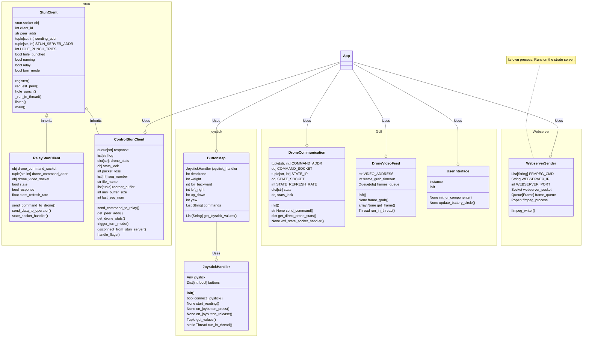

```mermaid
classDiagram

StunClient <|-- RelayStunClient : Inherits
StunClient <|-- ControlStunClient : Inherits

namespace stun{
    class StunClient {
        stun.socket obj
        int client_id
        str peer_addr
        tuple[str, int] sending_addr
        tuple[str, int] STUN_SERVER_ADDR
        int HOLE_PUNCH_TRIES
        bool hole_punched
        bool running
        bool relay
        bool turn_mode
        register()
        request_peer()
        hole_punch()
        _run_in_thread()
        listen()
        main()
    }

    class RelayStunClient{
        obj drone_command_socket
        tuple[str, int] drone_command_addr
        obj drone_video_socket
        bool state
        bool response
        float stats_refresh_rate
        send_command_to_drone()
        send_data_to_operator()
        state_socket_handler()
    }

    class ControlStunClient{
        queue[str] response
        list[str] log
        dict[str]: drone_stats
        obj stats_lock
        int packet_loss
        list[int] seq_number
        str file_name
        list[tuple] reorder_buffer
        int min_buffer_size
        int last_seq_num
        send_command_to_relay()
        get_peer_addr()
        get_drone_stats()
        trigger_turn_mode()
        disconnect_from_stun_server()
        handle_flags()
    }
}
ButtonMap --o JoystickHandler : Uses
namespace joystick {
    class ButtonMap {
        JoystickHandler joystick_handler
        int deadzone
        int weight
        int for_backward
        int left_right
        int up_down
        int yaw
        List[String] commands
        List[String] get_joystick_values()
    }

    class JoystickHandler {
        Any joystick
        Dict[int, bool] buttons
        __init__()
        bool connect_joystick()
        None start_reading()
        None on_joybutton_press()
        None on_joybutton_release()
        Tuple get_values()
        static Thread run_in_thread()
    }
}
namespace GUI{
    class DroneCommunication {
        tuple[str, int] COMMAND_ADDR
        obj COMMAND_SOCKET
        tuple[str, int] STATE_IP
        obj STATE_SOCKET
        int STATE_REFRESH_RATE
        dict[str] stats
        obj stats_lock
        __init__()
        str|None send_command()
        dict get_direct_drone_stats()
        None wifi_state_socket_handler()
    }
    class DroneVideoFeed {
        str VIDEO_ADDRESS
        int frame_grab_timeout
        Queue[obj] frames_queue
        __init__()
        None frame_grab()
        array|None get_frame()
        Thread run_in_thread()
    }
    class UserInterface {
        instance
        __init__
        None init_ui_components()
        None update_battery_circle()
    }
}
note for WebserverSender "Its own process. Runs on the strato server."
namespace Webserver {
    class WebserverSender {
        List[String] FFMPEG_CMD
        String WEBSERVER_IP
        int WEBSERVER_PORT
        Socket webserver_socket
        Queue[Frame] frame_queue
        Popen ffmpeg_process
        ffmpeg_writer()
    }
}

App --o ControlStunClient: Uses
App --o ButtonMap: Uses
App --o DroneCommunication : Uses
App --o DroneVideoFeed : Uses
App --o WebserverSender : Uses
App --o UserInterface : Uses
```
