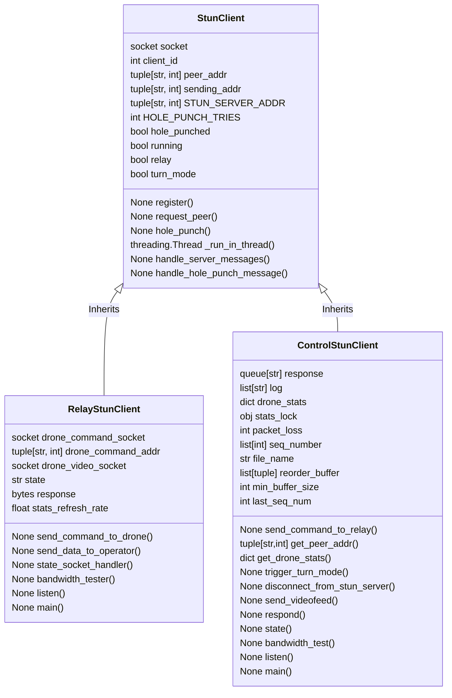

```mermaid

classDiagram
StunClient <|-- RelayStunClient : Inherits
StunClient <|-- ControlStunClient : Inherits


    class StunClient {
        socket socket
        int client_id
        tuple[str, int] peer_addr
        tuple[str, int] sending_addr
        tuple[str, int] STUN_SERVER_ADDR
        int HOLE_PUNCH_TRIES
        bool hole_punched
        bool running
        bool relay
        bool turn_mode
        None register()
        None request_peer()
        None hole_punch()
        threading.Thread _run_in_thread()
        None handle_server_messages()
        None handle_hole_punch_message()
    }

    class RelayStunClient{
        socket drone_command_socket
        tuple[str, int] drone_command_addr
        socket drone_video_socket
        str state
        bytes response
        float stats_refresh_rate
        None send_command_to_drone()
        None send_data_to_operator()
        None state_socket_handler()
        None bandwidth_tester()
        None listen()
        None main()
    }

    class ControlStunClient{
        queue[str] response
        list[str] log
        dict drone_stats
        obj stats_lock
        int packet_loss
        list[int] seq_number
        str file_name
        list[tuple] reorder_buffer
        int min_buffer_size
        int last_seq_num
        None send_command_to_relay()
        tuple[str,int] get_peer_addr()
        dict get_drone_stats()
        None trigger_turn_mode()
        None disconnect_from_stun_server()
        None send_videofeed()
        None respond()
        None state()
        None bandwidth_test()
        None listen()
        None main()
    }

```
