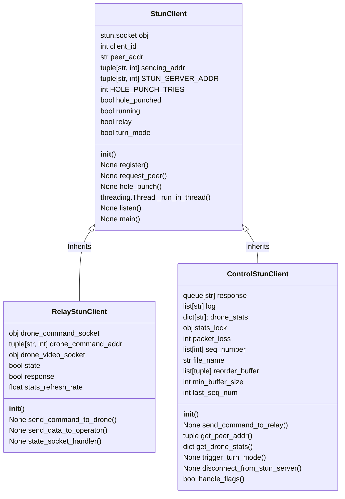

```mermaid
classDiagram
StunClient <|-- RelayStunClient : Inherits
StunClient <|-- ControlStunClient : Inherits

class StunClient {
    stun.socket obj
    int client_id
    str peer_addr
    tuple[str, int] sending_addr
    tuple[str, int] STUN_SERVER_ADDR
    int HOLE_PUNCH_TRIES
    bool hole_punched
    bool running
    bool relay
    bool turn_mode
    __init__()
    None register()
    None request_peer()
    None hole_punch()
    threading.Thread _run_in_thread()
    None listen()
    None main()
}

class RelayStunClient{
    obj drone_command_socket
    tuple[str, int] drone_command_addr
    obj drone_video_socket
    bool state
    bool response
    float stats_refresh_rate
    __init__()
    None send_command_to_drone()
    None send_data_to_operator()
    None state_socket_handler()
}

class ControlStunClient{
    queue[str] response
    list[str] log
    dict[str]: drone_stats
    obj stats_lock
    int packet_loss
    list[int] seq_number
    str file_name
    list[tuple] reorder_buffer
    int min_buffer_size
    int last_seq_num
    __init__()
    None send_command_to_relay()
    tuple get_peer_addr()
    dict get_drone_stats()
    None trigger_turn_mode()
    None disconnect_from_stun_server()
    bool handle_flags()
}
```
